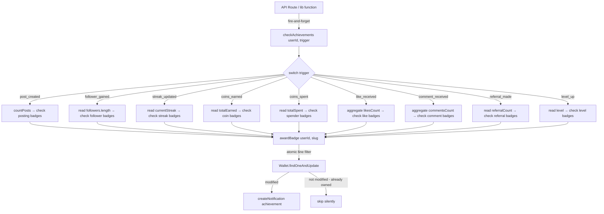

# Design Document: Achievements & Badges

## Overview

The Achievements & Badges system rewards CampusX users for reaching milestones across posting, social growth, streaks, economy, and engagement. It is designed as a thin, non-blocking layer on top of the existing coins/wallet infrastructure.

Key design decisions:
- **Reuse over reinvent**: Badges are `ShopItem` documents with `category: 'achievement_badge'`, stored in `Wallet.inventory[]` exactly like the existing `awardWhaleBadge()` pattern.
- **Fire-and-forget everywhere**: Badge checks never block HTTP responses. Every trigger site calls `checkAchievements(userId, trigger).catch(() => {})`.
- **Single entry point**: All badge logic lives in `lib/achievements.js` — one function, `checkAchievements(userId, trigger)`, dispatches to per-trigger handlers.
- **Idempotency by atomic query**: The `$ne` filter on `findOneAndUpdate` prevents double-awards without needing a separate lock or transaction.

---

## Architecture



**Trigger wiring map:**

| Trigger | Location | Condition |
|---|---|---|
| `post_created` | `app/api/posts/create/route.js` | After post saved, non-anonymous only |
| `follower_gained` | `app/api/follow/route.js` | After follow (not unfollow) |
| `streak_updated` | `lib/xp.js` → `awardXP()` | After streak increment (needs streak update hook) |
| `coins_earned` | `lib/coins.js` → `awardCoins()` | After successful coin award |
| `coins_spent` | `lib/coins.js` → `spendCoins()` | After successful purchase |
| `like_received` | `app/api/posts/like/route.js` | After like added (not unlike) |
| `comment_received` | `app/api/posts/[postId]/comments/route.js` | After comment created on another user's post |
| `referral_made` | `app/api/auth/signup/route.js` | After referral recorded |
| `level_up` | `lib/xp.js` → `awardXP()` | After level increases |

---

## Components and Interfaces

### `lib/achievements.js`

```js
// Public API
export async function checkAchievements(userId, trigger) { ... }

// Internal helpers
async function awardBadge(userId, slug) { ... }
async function checkPostingBadges(userId) { ... }
async function checkFollowerBadges(userId) { ... }
async function checkStreakBadges(userId) { ... }
async function checkCoinsEarnedBadges(userId) { ... }
async function checkCoinsSpentBadges(userId) { ... }
async function checkLikeBadges(userId) { ... }
async function checkCommentBadges(userId) { ... }
async function checkReferralBadges(userId) { ... }
async function checkLevelBadges(userId) { ... }

// Static catalog
const BADGE_CATALOG = [ ... ]
```

**`checkAchievements(userId, trigger)`**
- Entry point. Wraps everything in try/catch — never throws.
- Dispatches to the appropriate check function based on `trigger`.
- Unknown triggers are silently ignored.

**`awardBadge(userId, slug)`**
- Looks up the `ShopItem` by slug (cached in memory after first load).
- Calls `Wallet.findOneAndUpdate` with `{ 'inventory.itemId': { $ne: badge._id } }` filter.
- If the document was modified (badge newly added), creates an `achievement` notification.
- Returns `true` if awarded, `false` if already owned or not found.

**`BADGE_CATALOG`**
- A plain JS array of `{ slug, emoji, name, description, condition }` objects.
- Used by the seed script and by `checkAchievements` to know which slugs to check per trigger.
- Grouped by trigger type for O(1) dispatch.

### `models/ShopItem.js` — category enum update

Add `'achievement_badge'` to the `category` enum:

```js
enum: [
  'avatar_frame', 'username_color', 'profile_banner', 'post_badge',
  'chat_bubble', 'bio_theme', 'special_badge', 'profile_theme',
  'effect', 'entry_effect',
  'achievement_badge'   // ← new
]
```

### `scripts/seed-badges.mjs`

- Imports `BADGE_CATALOG` from `lib/achievements.js` (or a shared constants file).
- For each badge, calls `ShopItem.findOneAndUpdate({ slug }, { $setOnInsert: {...} }, { upsert: true })`.
- Counts `upsertedCount` vs `matchedCount` to report created vs skipped.

### Profile API — `app/api/users/[username]/route.js`

Add `earnedBadges` to the GET response:

```js
// After fetching userResult, fetch wallet and join badge items
const wallet = await Wallet.findOne({ userId: userResult._id })
  .select('inventory').lean()

const badgeItemIds = wallet?.inventory?.map(i => i.itemId) ?? []
const badgeItems = await ShopItem.find({
  _id: { $in: badgeItemIds },
  category: 'achievement_badge'
}).select('slug name visual').lean()

// Build earnedAt map from inventory
const earnedAtMap = Object.fromEntries(
  (wallet?.inventory ?? []).map(i => [i.itemId.toString(), i.purchasedAt])
)

const earnedBadges = badgeItems.map(item => ({
  slug: item.slug,
  name: item.name,
  emoji: item.visual?.emoji ?? '',
  earnedAt: earnedAtMap[item._id.toString()]
}))
```

### `components/profile/BadgesSection.js`

Client component rendered on the profile page below the activity heatmap.

Props: `{ badges: Array<{ slug, name, emoji, earnedAt }> }`

Renders:
- Section heading "Achievements"
- Grid of badge pills: `{emoji} {name}`
- Empty state: "No badges yet" when `badges.length === 0`

---

## Data Models

### ShopItem (modified)

```
category: enum [...existing..., 'achievement_badge']
```

For achievement badges specifically:
- `price: 0` — free, awarded by system
- `isActive: true`
- `visual: { emoji: '📝' }` — minimal visual, just the emoji
- `rarity: 'common'` (default) — can be overridden per badge

### Wallet.inventory[] (unchanged)

Each entry: `{ itemId: ObjectId<ShopItem>, purchasedAt: Date }`

Badge items are stored identically to purchased shop items. `purchasedAt` serves as `earnedAt`.

### Notification (unchanged)

Achievement notifications use:
```js
{
  type: 'achievement',
  recipient: userId,
  sender: null,
  meta: { badgeSlug, badgeName, badgeEmoji }
}
```

The `dedupeKey` for achievement notifications is `achievement_{recipient}_{badgeSlug}` — this prevents duplicate notifications if `awardBadge` is somehow called twice before the wallet update completes (belt-and-suspenders on top of the atomic query).

---

## Correctness Properties

*A property is a characteristic or behavior that should hold true across all valid executions of a system — essentially, a formal statement about what the system should do. Properties serve as the bridge between human-readable specifications and machine-verifiable correctness guarantees.*

### Property 1: Badge document shape invariant

*For any* badge slug defined in `BADGE_CATALOG`, the corresponding `ShopItem` document in the database must have `category === 'achievement_badge'`, `price === 0`, and `isActive === true`.

**Validates: Requirements 1.2**

---

### Property 2: Milestone threshold coverage

*For any* trigger type and any metric value N (post count, follower count, streak, totalEarned, totalSpent, total likes, total comments, referralCount, or level), after `checkAchievements` runs, the user's wallet inventory must contain every badge whose unlock threshold is ≤ N for that trigger's badge group, and must not contain any badge whose threshold is > N (unless previously earned via a different trigger invocation).

**Validates: Requirements 4.2, 4.3, 5.2, 6.2, 7.2, 7.4, 8.2, 8.4, 9.2, 10.2**

---

### Property 3: Badge award idempotency

*For any* user and any badge slug, calling `awardBadge(userId, slug)` any number of times must result in exactly one entry for that badge in `Wallet.inventory[]` — never zero after the first successful call, never more than one regardless of how many times it is called.

**Validates: Requirements 2.1, 2.2, 3.4**

---

### Property 4: Notification on new award only

*For any* user and badge slug, a `Notification` document of type `'achievement'` with matching `meta.badgeSlug` must be created exactly once — on the first successful award — and must not be created on subsequent calls where the badge is already owned.

**Validates: Requirements 3.1, 3.2, 3.4**

---

### Property 5: Error non-propagation

*For any* call to `checkAchievements(userId, trigger)` — including calls with invalid userIds, non-existent slugs, or simulated DB failures — the returned Promise must always resolve (never reject), and the calling code must not observe any thrown exception.

**Validates: Requirements 2.4, 3.3, 12.3**

---

### Property 6: Profile API earnedBadges shape

*For any* username, the `GET /api/users/[username]` response must include an `earnedBadges` array where every element has `slug` (string), `name` (string), `emoji` (string), and `earnedAt` (Date), and every element corresponds to a `ShopItem` with `category === 'achievement_badge'` in the user's wallet inventory.

**Validates: Requirements 11.1, 11.2**

---

### Property 7: Seed script idempotency

*For any* number of times the seed script is run against the same database, the total count of `ShopItem` documents with `category === 'achievement_badge'` must equal exactly the number of badges defined in `BADGE_CATALOG` — no more, no less.

**Validates: Requirements 13.1, 13.2**

---

## Error Handling

All errors inside `checkAchievements` and `awardBadge` are caught at the outermost level and logged with `console.error('[Achievements]', ...)`. The function always resolves. This mirrors the pattern used by `awardCoins` and `createNotification`.

Specific cases:
- **Badge slug not in DB**: `awardBadge` returns `false` silently. This is expected during development before seeding.
- **Wallet not found**: `getOrCreateWallet` is called first to ensure the wallet exists.
- **Notification failure**: Wrapped in its own `.catch()` inside `awardBadge` — badge award is not rolled back if notification fails.
- **DB connection failure**: Caught by the outer try/catch in `checkAchievements`.

The `badge-whale` badge at 10,000 coins is intentionally excluded from the `coins_earned` handler in `checkAchievements` — it continues to be handled by the existing `awardWhaleBadge()` call inside `lib/coins.js` to avoid duplication.

---

## Testing Strategy

### Dual approach

Both unit tests and property-based tests are required. Unit tests cover specific integration examples and edge cases. Property tests verify universal correctness across randomized inputs.

### Property-based testing

Use **fast-check** (JavaScript PBT library). Each property test runs a minimum of **100 iterations**.

Each test is tagged with a comment:
```
// Feature: achievements-badges, Property N: <property text>
```

Property test mapping:

| Property | Test description |
|---|---|
| P1 | For each slug in BADGE_CATALOG, assert DB document has correct shape |
| P2 | Generate random metric value N, set up user state, run checkAchievements, assert all badges with threshold ≤ N are in inventory |
| P3 | Generate random userId + slug, call awardBadge N times (N ≥ 2), assert inventory has exactly 1 entry |
| P4 | Generate random userId + slug, call awardBadge twice, assert Notification count for that slug is exactly 1 |
| P5 | Generate random invalid inputs (null userId, garbage trigger), assert checkAchievements always resolves |
| P6 | Generate random user with N badges, call profile API, assert response shape and category filter |
| P7 | Run seed script twice, assert ShopItem count equals BADGE_CATALOG.length |

### Unit tests

Focus on:
- Trigger wiring: after post creation, `checkAchievements` is called with correct userId and `'post_created'`
- Trigger wiring: after follow, `checkAchievements` is called with followed user's ID and `'follower_gained'`
- Trigger wiring: after like, `checkAchievements` is called with post author's ID and `'like_received'`
- `awardBadge` with a slug not in DB returns `false` without throwing
- `BadgesSection` renders empty state when `badges` prop is `[]`
- `BadgesSection` renders correct emoji and name for each badge

### Unit testing balance

Avoid writing unit tests for every badge threshold — that is exactly what Property 2 covers via randomized inputs. Unit tests should focus on integration wiring and edge cases that property tests cannot easily express (e.g., UI rendering, specific API response shapes).
