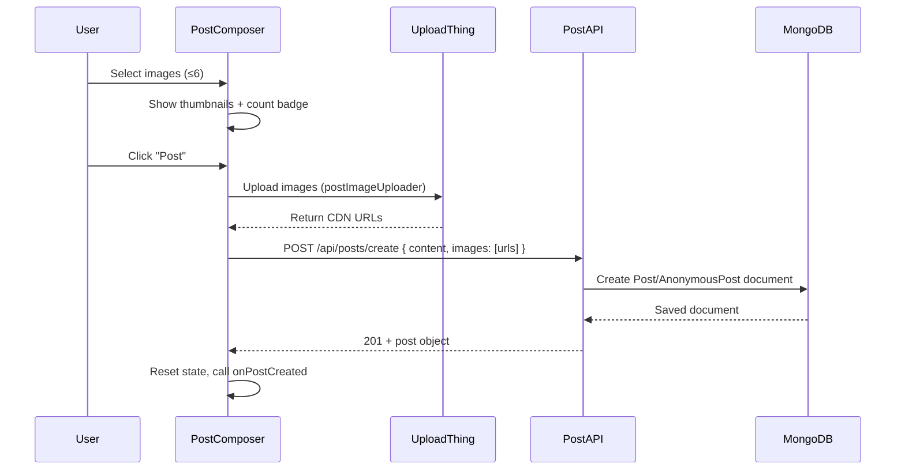

# Design Document: Post Image Upload

## Overview

This feature adds image attachment support to the CampusX post composer. Users can select up to 6 images, preview them before posting, and view them in the feed via a responsive image grid. Images are uploaded to UploadThing before the post is created, so the post document stores only CDN URLs. The feature touches five layers: Mongoose models, UploadThing file router, post creation API, PostComposer UI, and a new PostImageGrid display component.

The existing `resourceUploader` UploadThing endpoint is left untouched. A new `postImageUploader` endpoint is added alongside it, reusing the same JWT verification and DB connection helpers.

---

## Architecture



**Key design decisions:**

- Upload-before-submit: images are uploaded to UploadThing first, then only CDN URLs are sent to the post API. This keeps the post API simple (no multipart handling) and avoids orphaned uploads on API failure.
- Abort on upload failure: if any image fails to upload, the entire submission is aborted and the composer state is preserved so the user doesn't lose their text.
- No separate upload state file: upload progress is tracked in local component state (`isUploading`), not in a global store.

---

## Components and Interfaces

### 1. `postImageUploader` (UploadThing endpoint)

Added to `app/api/uploadthing/core.js` alongside `resourceUploader`.

```js
postImageUploader: f({ image: { maxFileSize: "8MB", maxFileCount: 6 } })
  .middleware(async ({ req }) => { /* same JWT + DB logic as resourceUploader */ })
  .onUploadComplete(async ({ metadata, file }) => ({
    url: file.url,
    key: file.key,
    uploadedBy: metadata.userId,
  }))
```

The middleware is extracted into a shared `authenticateRequest(req)` helper to avoid duplication between `resourceUploader` and `postImageUploader`.

### 2. `PostComposer` changes

New state:
```js
const [selectedImages, setSelectedImages] = useState([])   // File[] — local files before upload
const [isUploading, setIsUploading] = useState(false)
```

New UI elements:
- Image attachment button (camera icon) in the toolbar
- Hidden `<input type="file" accept="image/*" multiple ref={fileInputRef} />`
- `ImagePreviewStrip` — inline sub-component rendering thumbnails with remove buttons and a horizontal scroll container
- Count badge `"{n}/6"` next to the attachment button when `selectedImages.length > 0`

`handleSubmit` flow change:
1. If `selectedImages.length > 0`, call `startUpload(selectedImages)` from `useUploadThing("postImageUploader")`
2. Await URLs; on failure show toast and return (do not clear composer)
3. Include `images: uploadedUrls` in the POST body

### 3. `PostImageGrid` (new component)

Path: `components/post/PostImageGrid.js`

Props: `{ images: string[] }` — array of CDN URLs (1–6 items).

Layout logic:
- `images.length === 1` → single full-width image, aspect ratio 16/9
- `images.length === 2` → two columns, equal width, aspect ratio 1/1
- `images.length >= 3` → first image full-width (16/9), remaining images in a 2-column grid below (1/1 aspect ratio), capped at 6

Each image uses `<Image>` from `next/image` with `fill` inside a sized container div, `loading="lazy"`, `sizes` prop for responsive srcSet, and `className="object-cover"`.

Click handler: opens image URL in a new tab (`window.open(url, '_blank')`). A future iteration can replace this with a lightbox modal.

### 4. `PostCard` changes

Import `PostImageGrid` dynamically (lazy):
```js
const PostImageGrid = dynamic(() => import('@/components/post/PostImageGrid'), { ssr: false })
```

Render after `<PostContent>` and before the poll:
```jsx
{post.images?.length > 0 && (
  <div onClick={(e) => e.stopPropagation()}>
    <PostImageGrid images={post.images} />
  </div>
)}
```

### 5. Post API (`/api/posts/create/route.js`)

Destructure `images` from body:
```js
const { content, community, isAnonymous, poll, linkPreview, images } = body;
```

Validation:
```js
if (images !== undefined) {
  if (!Array.isArray(images) || images.length > 6)
    return 400 "Maximum 6 images allowed"
  if (images.some(url => typeof url !== 'string' || !url.trim()))
    return 400 "Invalid image URL"
}
```

Pass to `postData`:
```js
postData.images = Array.isArray(images) ? images : []
```

### 6. Model changes

`models/Post.js` and `models/AnonymousPost.js`:
```js
// Change:
validate: [v => v.length <= 4, 'You can upload a maximum of 4 images']
// To:
validate: [v => v.length <= 6, 'You can upload a maximum of 6 images']
```

---

## Data Models

### Post / AnonymousPost `images` field (updated)

```js
images: {
  type: [String],
  validate: [v => v.length <= 6, 'You can upload a maximum of 6 images'],
}
```

No migration needed — existing documents with 0–4 images remain valid. The validator only fires on save.

### UploadThing `onUploadComplete` return shape

```ts
{
  url: string      // CDN URL stored in Post.images[]
  key: string      // UploadThing file key (for future deletion)
  uploadedBy: string  // userId
}
```

Only `url` is stored in the post document. `key` and `uploadedBy` are returned to the client but not persisted in the post (can be added later for deletion support).

---

## Correctness Properties

*A property is a characteristic or behavior that should hold true across all valid executions of a system — essentially, a formal statement about what the system should do. Properties serve as the bridge between human-readable specifications and machine-verifiable correctness guarantees.*

### Property 1: Model rejects images arrays exceeding 6

*For any* post document (Post or AnonymousPost) where the `images` array has more than 6 elements, calling `.save()` or `.create()` SHALL throw a Mongoose ValidationError, and for any array with 6 or fewer elements it SHALL succeed.

**Validates: Requirements 1.1, 1.2, 1.3, 1.4**

### Property 2: UploadThing middleware rejects unauthenticated requests

*For any* incoming request that does not carry a valid `campusx_token` cookie (missing, expired, or tampered), the `postImageUploader` middleware SHALL throw an UploadThingError with code `UNAUTHORIZED`.

**Validates: Requirements 2.4**

### Property 3: Composer thumbnail count matches selection

*For any* set of selected image files with count n (1 ≤ n ≤ 6), the PostComposer SHALL render exactly n thumbnail elements in the preview strip.

**Validates: Requirements 3.3**

### Property 4: Composer enforces 6-image cap

*For any* existing selection of size k and any new batch of files of size m where k + m > 6, the PostComposer SHALL keep the selection at min(k + m, 6) images (rejecting the excess) and display an error message.

**Validates: Requirements 3.4**

### Property 5: Remove image preserves remaining selection

*For any* image list of length n (n ≥ 1) and any index i (0 ≤ i < n), removing the image at index i SHALL produce a list of length n − 1 containing all original images except the one at index i, in their original relative order.

**Validates: Requirements 3.5**

### Property 6: Count badge reflects selection size

*For any* selection of n images (1 ≤ n ≤ 6), the count badge rendered near the attachment button SHALL display the string `"{n}/6"`.

**Validates: Requirements 3.6**

### Property 7: Composer resets images on successful submit

*For any* composer state with n selected images, after a successful post submission the `selectedImages` state SHALL be empty and no thumbnails SHALL be rendered.

**Validates: Requirements 3.7**

### Property 8: Composer preserves content on upload failure

*For any* composer content string and any upload failure, the `content` state SHALL remain equal to its value before the submit attempt, and the Post API SHALL NOT be called.

**Validates: Requirements 4.4**

### Property 9: Post API persists image URLs round-trip

*For any* valid `images` array of 1–6 non-empty URL strings sent to `POST /api/posts/create`, the returned post document SHALL contain an `images` field equal to the submitted array, for both regular and anonymous posts.

**Validates: Requirements 5.1, 5.5**

### Property 10: Post API rejects oversized images array

*For any* `images` array with more than 6 entries sent to `POST /api/posts/create`, the API SHALL return HTTP 400.

**Validates: Requirements 5.2**

### Property 11: Post API rejects invalid image entries

*For any* `images` array containing at least one empty string or non-string value, the API SHALL return HTTP 400.

**Validates: Requirements 5.3**

### Property 12: ImageGrid renders lazy-loaded images with explicit sizing

*For any* `images` array of length 1–6, every `<Image>` element rendered by PostImageGrid SHALL have `loading="lazy"` and either explicit `width`/`height` props or the `fill` prop with a sized container.

**Validates: Requirements 6.2, 8.2, 8.3**

---

## Error Handling

| Scenario | Handling |
|---|---|
| User selects > 6 images | Reject excess files client-side; show `toast.error("Maximum 6 images allowed")` |
| UploadThing upload fails | Show `toast.error("Image upload failed")`, abort submit, preserve composer state |
| Post API returns 400 (images) | Show `toast.error(message)` from API response |
| Post API returns 500 | Show generic `toast.error("Failed to post")` |
| Unauthenticated upload attempt | UploadThing middleware throws UNAUTHORIZED; client receives error from `useUploadThing` |
| Image fails to render in grid | `onError` handler hides the broken image element gracefully |
| No images field in request | API defaults to empty array; post created normally |

---

## Testing Strategy

### Unit Tests

Focus on specific examples, edge cases, and integration points:

- PostImageGrid renders correct layout for n=1, n=2, n=3, n=6 (layout examples)
- PostImageGrid renders nothing when `images` is empty or undefined
- PostComposer renders image attachment button
- PostComposer file input has `accept="image/*"` and `multiple`
- Post API returns 201 with empty images when no `images` field provided
- Post API returns 400 when images array has 7 entries
- Post API returns 400 when images array contains an empty string
- UploadThing `onUploadComplete` returns object with `url` and `key`

### Property-Based Tests

Use **fast-check** (already compatible with Jest/Vitest in Next.js projects).

Each property test runs a minimum of **100 iterations**.

Tag format: `// Feature: post-image-upload, Property {N}: {property_text}`

**Property 1 — Model rejects images arrays exceeding 6**
```
// Feature: post-image-upload, Property 1: Model rejects images arrays exceeding 6
fc.property(
  fc.array(fc.string(), { minLength: 7, maxLength: 20 }),
  async (images) => {
    await expect(Post.create({ content: 'test', author: userId, images }))
      .rejects.toThrow(/maximum 6 images/i)
  }
)
```

**Property 2 — UploadThing middleware rejects unauthenticated requests**
```
// Feature: post-image-upload, Property 2: UploadThing middleware rejects unauthenticated requests
fc.property(
  fc.oneof(fc.constant(null), fc.string({ minLength: 1 })), // null or garbage token
  async (token) => {
    const req = mockRequest(token)
    await expect(postImageUploaderMiddleware({ req }))
      .rejects.toMatchObject({ code: 'UNAUTHORIZED' })
  }
)
```

**Property 3 — Composer thumbnail count matches selection**
```
// Feature: post-image-upload, Property 3: Composer thumbnail count matches selection
fc.property(
  fc.array(fc.record({ name: fc.string(), size: fc.nat() }), { minLength: 1, maxLength: 6 }),
  (files) => {
    const { getAllByRole } = render(<PostComposer ... />)
    fireEvent.change(fileInput, { target: { files } })
    expect(getAllByRole('img', { name: /preview/i })).toHaveLength(files.length)
  }
)
```

**Property 4 — Composer enforces 6-image cap**
```
// Feature: post-image-upload, Property 4: Composer enforces 6-image cap
fc.property(
  fc.integer({ min: 1, max: 6 }),
  fc.integer({ min: 1, max: 10 }),
  (existing, adding) => {
    // set up composer with `existing` images, then add `adding` more
    // result should be min(existing + adding, 6)
    expect(selectedImages.length).toBeLessThanOrEqual(6)
    if (existing + adding > 6) expect(errorToastShown).toBe(true)
  }
)
```

**Property 5 — Remove image preserves remaining selection**
```
// Feature: post-image-upload, Property 5: Remove image preserves remaining selection
fc.property(
  fc.array(fc.string({ minLength: 1 }), { minLength: 1, maxLength: 6 }),
  fc.nat(),
  (images, rawIndex) => {
    const index = rawIndex % images.length
    const result = removeImage(images, index)
    expect(result).toHaveLength(images.length - 1)
    expect(result).not.toContain(images[index])
    expect(result).toEqual([...images.slice(0, index), ...images.slice(index + 1)])
  }
)
```

**Property 6 — Count badge reflects selection size**
```
// Feature: post-image-upload, Property 6: Count badge reflects selection size
fc.property(
  fc.integer({ min: 1, max: 6 }),
  (n) => {
    // render composer with n selected images
    expect(screen.getByText(`${n}/6`)).toBeInTheDocument()
  }
)
```

**Property 7 — Composer resets images on successful submit**
```
// Feature: post-image-upload, Property 7: Composer resets images on successful submit
fc.property(
  fc.array(fc.string({ minLength: 1 }), { minLength: 1, maxLength: 6 }),
  async (images) => {
    // set up composer with images, mock successful upload + API
    await submitPost()
    expect(selectedImages).toHaveLength(0)
  }
)
```

**Property 8 — Composer preserves content on upload failure**
```
// Feature: post-image-upload, Property 8: Composer preserves content on upload failure
fc.property(
  fc.string({ minLength: 1, maxLength: 500 }),
  async (content) => {
    // set content, mock upload failure
    await submitPost()
    expect(composerContent).toEqual(content)
    expect(postApiCalled).toBe(false)
  }
)
```

**Property 9 — Post API persists image URLs round-trip**
```
// Feature: post-image-upload, Property 9: Post API persists image URLs round-trip
fc.property(
  fc.array(fc.webUrl(), { minLength: 1, maxLength: 6 }),
  fc.boolean(), // isAnonymous
  async (images, isAnonymous) => {
    const res = await POST(mockRequest({ content: 'test', images, isAnonymous }))
    const body = await res.json()
    expect(res.status).toBe(201)
    expect(body.images).toEqual(images)
  }
)
```

**Property 10 — Post API rejects oversized images array**
```
// Feature: post-image-upload, Property 10: Post API rejects oversized images array
fc.property(
  fc.array(fc.webUrl(), { minLength: 7, maxLength: 20 }),
  async (images) => {
    const res = await POST(mockRequest({ content: 'test', images }))
    expect(res.status).toBe(400)
  }
)
```

**Property 11 — Post API rejects invalid image entries**
```
// Feature: post-image-upload, Property 11: Post API rejects invalid image entries
fc.property(
  fc.array(fc.oneof(fc.constant(''), fc.constant('  '), fc.integer()), { minLength: 1, maxLength: 6 }),
  async (images) => {
    const res = await POST(mockRequest({ content: 'test', images }))
    expect(res.status).toBe(400)
  }
)
```

**Property 12 — ImageGrid renders lazy-loaded images with explicit sizing**
```
// Feature: post-image-upload, Property 12: ImageGrid renders lazy-loaded images with explicit sizing
fc.property(
  fc.array(fc.webUrl(), { minLength: 1, maxLength: 6 }),
  (images) => {
    const { container } = render(<PostImageGrid images={images} />)
    const imgs = container.querySelectorAll('img')
    imgs.forEach(img => {
      expect(img.getAttribute('loading')).toBe('lazy')
    })
    // Each image is inside a container with explicit dimensions (fill pattern)
    expect(imgs).toHaveLength(images.length)
  }
)
```
