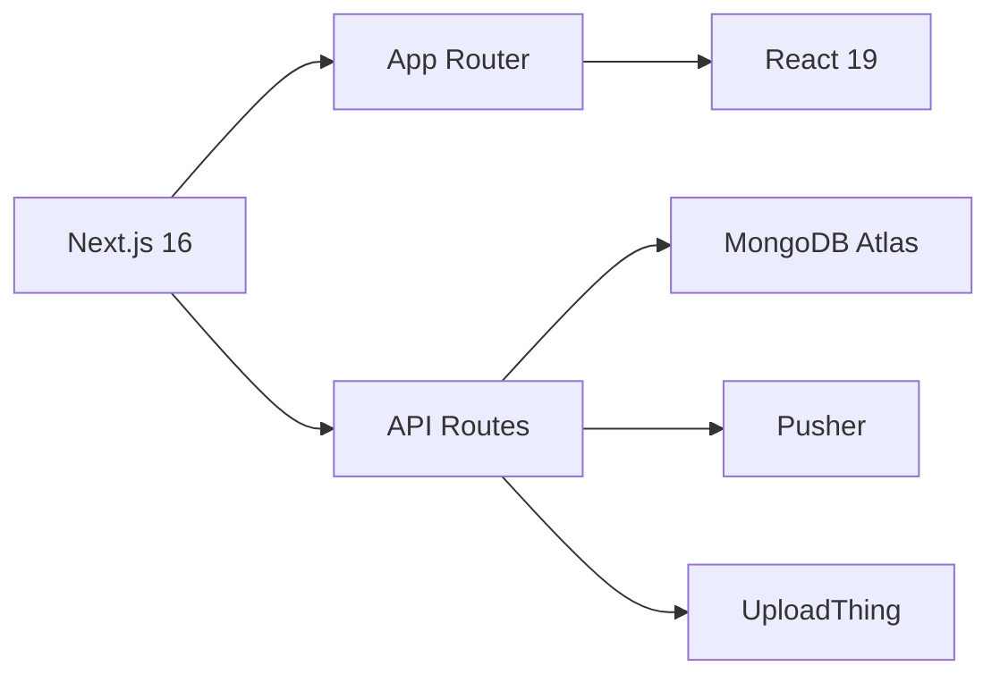

<div align="center">


[](https://nextjs.org)
[](https://react.dev)
[](https://mongodb.com)
[](https://pusher.com)
[](https://tailwindcss.com)
[](https://vercel.com)

<h3>The social platform built exclusively for Indian college students</h3>

<a href="https://campus-x-rho.vercel.app">
  
</a>

[](https://deepscan.io/dashboard#view=project&tid=29783&pid=31636&bid=1028158)

</div>

---

## ✨ Why CampusZen?

> **Not LinkedIn. Not Instagram. Not WhatsApp groups.**  
> A dedicated space where students connect, share, and grow — verified college identity only.

Every Indian college student lives across 5 different platforms — WhatsApp for updates, Instagram for photos, LinkedIn for fake achievements, Telegram for notes, and Google Forms for events. **None of them are built for students.**

**CampusZen** is a student-only social network where you need a verified college email to join. Real identity. Real campus community. No recruiters, no ads, no noise — just your college, your people, and your content.

<div align="center">

| 🎯 Target | 📍 Focus | 👨‍💻 Built By |
|---|---|---|
| 40M+ Indian Students | IGNOU & DTU | Solo Developer (Ayush) |

</div>

---

## 🚀 Core Features

<div align="center">

| | | |
|:---:|:---:|:---:|
|  **Verified Identity** |  **Smart Feed** |  **Real-time Chat** |
| College Email + OTP ✅ | AI-ranked posts 📊 | Pusher-powered 💬 |
| | | |
|  **Admin Panel** |  **PWA Ready** |  **Dark Theme** |
| Full moderation tools 🛡️ | Install on mobile 📱 | #0f0f0f optimized 🌙 |

</div>

</div>

---

### 🎓 Student Verification
```
College Email → OTP Sent → Verified Badge ✓
```
Only real students get in. No fake accounts, no outsiders. Verified badge shows on every post and profile.

---

### 📰 Smart Feed Algorithm
Posts are ranked by a weighted score — not just chronological order:

```
Feed Score = (Likes × 1.5) + (Comments × 2) + (Views × 0.5)
           + Recency Boost + Connection Boost
```

Students see relevant content from their college first, trending content second.

---

### 💬 Real-time Features
- **Live notifications** — instant alerts for likes, comments, follows
- **Notification sound** — toggle on/off
- **Trending sidebar** — top posts updating live
- **View counts** — see how many students viewed your post

---

### 🛡️ Admin Moderation Panel
Full admin dashboard to manage content, users, and reports — keeping the campus feed clean and safe.

---

## 🔥 What's Live

| Feature | Status |
|---|---|
| Student email verification + OTP | ✅ |
| Verified badge on profiles | ✅ |
| JWT auth with HTTP-only cookies | ✅ |
| Post feed with image upload | ✅ |
| Like, comment, share on posts | ✅ |
| View count per post | ✅ |
| Smart feed algorithm | ✅ |
| Real-time notifications (Pusher) | ✅ |
| Notification sound toggle | ✅ |
| Trending posts sidebar | ✅ |
| Community rooms | ✅ |
| User profiles + account settings | ✅ |
| 3-dot post menu (edit/delete/report) | ✅ |
| Admin moderation panel | ✅ |
| Forgot password flow | ✅ |
| PWA (installable on Android) | ✅ |
| SEO optimized pages | ✅ |
| Mobile responsive | ✅ |
| Dark theme (#0f0f0f) | ✅ |

---

## 🛠️ Tech Stack

<div align="center">



| Layer | Technology | Badge |
|---|---|---|
| ⚡ Framework | Next.js 16 App Router |  |
| ⚛️ UI Library | React 19 |  |
| 🗄️ Database | MongoDB + Mongoose |  |
| 🔐 Authentication | Better Auth + JWT |  |
| ⚡ Real-time | Pusher Channels |  |
| 📦 File Upload | UploadThing |  |
| 🎨 Styling | Tailwind CSS 4 |  |
| ✨ Animations | Framer Motion + GSAP |  |
| 🎯 Components | shadcn/ui + Radix |  |
| ☁️ Deployment | Vercel |  |

</div>

---

## 📁 Project Structure

```
campusx/
├── app/
│   ├── (auth)/
│   │   ├── login/
│   │   ├── register/
│   │   └── verify/          # OTP verification
│   ├── (main)/
│   │   ├── feed/            # Smart algorithm feed
│   │   ├── communities/     # Community rooms
│   │   ├── notifications/   # Real-time notifications
│   │   └── profile/[id]/    # User profiles
│   ├── admin/               # Moderation panel
│   └── api/                 # All API routes
├── components/
│   ├── ui/                  # shadcn components
│   ├── feed/                # Feed specific components
│   ├── post/                # Post card, actions
│   └── shared/              # Navbar, sidebar, etc.
├── lib/
│   ├── db.js                # MongoDB connection
│   ├── auth.js              # JWT helpers
│   └── utils.js
└── models/                  # Mongoose schemas
    ├── User.js
    ├── Post.js
    ├── Community.js
    └── Notification.js
```

---

## 🚦 Getting Started

### Prerequisites
- Node.js 18+
- MongoDB Atlas account (free tier)
- Pusher account (free tier)
- UploadThing account (free tier)

### Setup

```bash
# Clone the repo
git clone https://github.com/ayush0x00/campusx.git
cd campusx

# Install dependencies
npm install

# Create environment file
cp .env.example .env.local
```

### Environment Variables

```env
# MongoDB
MONGODB_URI=mongodb+srv://...

# JWT
JWT_SECRET=your_super_secret_key

# Pusher
PUSHER_APP_ID=
PUSHER_KEY=
PUSHER_SECRET=
PUSHER_CLUSTER=
NEXT_PUBLIC_PUSHER_KEY=
NEXT_PUBLIC_PUSHER_CLUSTER=

# UploadThing
UPLOADTHING_SECRET=
UPLOADTHING_APP_ID=

# App
NEXT_PUBLIC_APP_URL=http://localhost:3000
```

```bash
# Start development server
npm run dev
```

Open `http://localhost:3000`

---

## 🔒 Security

CampusX is built with security as a first principle:

- **HTTP-only cookies** — JWT tokens never accessible via JavaScript
- **College email verification** — OTP-based, blocks fake signups
- **Rate limiting** on auth routes — prevents brute force
- **Input sanitization** on all API routes
- **Admin-only routes** protected by role middleware
- **No sensitive data in client** — all secrets server-side only

---

## 🗺️ The Problem We're Solving

Indian college students have no dedicated digital home:

- **WhatsApp groups** — chaotic, no content discovery, admin-controlled
- **Instagram** — algorithm hides college content, not student-specific
- **LinkedIn** — professional pressure, no casual peer connection
- **Telegram** — anonymous, unsafe, no verified identity

CampusX gives students a **verified, safe, college-first** social space.

**Target market:** 40 million+ college students in India.  
**Initial focus:** IGNOU (4M students) and DTU, Delhi.

---

## 📋 Roadmap

- [ ] College-specific sub-feeds
- [ ] Anonymous confession board (verified but anonymous posts)
- [ ] Study group finder
- [ ] Campus events calendar
- [ ] Internship/placement board (student-to-student, not corporate)
- [ ] Notes and resource sharing
- [ ] Push notifications (Web Push API)
- [ ] iOS PWA improvements
- [ ] Multi-college expansion

---

## 🌐 Deployment

Live on dual deployment for maximum reliability:

| Platform | URL | Status |
|---|---|---|
| Vercel (Primary) | campus-x-rho.vercel.app | ✅ |
| Netlify (Backup) | campus-x-rho.netlify.app | ✅ |

Both deployments pull from the same GitHub repo — if one goes down, the other handles traffic.

---

## 🤝 Contributing

CampusX is in active development. If you're a student or developer who wants to contribute:

1. Fork the repo
2. Create a branch: `git checkout -b feature/your-feature`
3. Commit: `git commit -m "add your feature"`
4. Push: `git push origin feature/your-feature`
5. Open a Pull Request

---

## 📜 License

MIT License — see [LICENSE](LICENSE) for details.

---

<div align="center">

[](https://github.com/user-synax/campusX)

**Made with ❤️ in Delhi, India** 🇮🇳

*Built by Ayush — self-taught full stack developer. Every line of code, every design decision — solo.*

</div>
